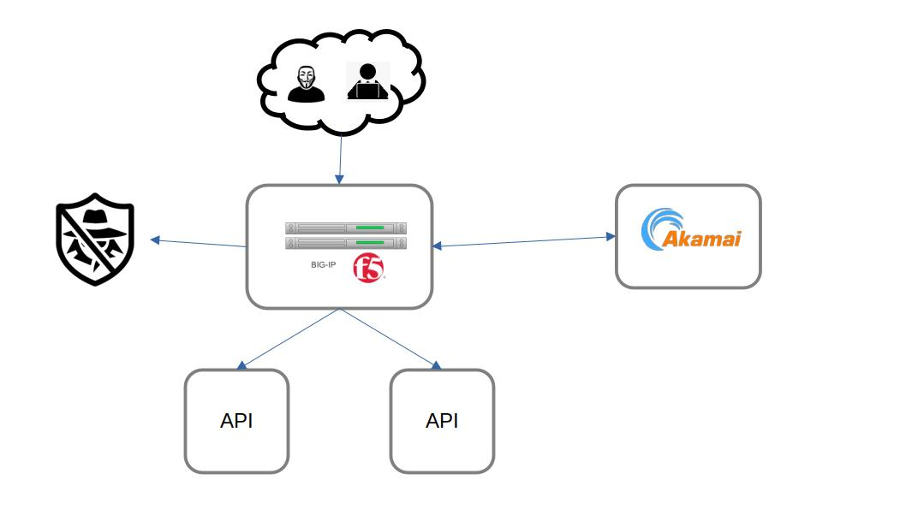

# Akamai API Security with F5 Lab

Welcome to WWT's Akamai API Security with F5 lab. The purpose of this lab is to demo the API security utilizing Akamai API Security and leveraging F5's BIG-IP LTM to capture the needed data and pass that to Akamai API Security.  

## Getting Access

The only requirement to access the lab environment is a WWT ATC user account and a modern web browser (testing was completed with chrome).

To access the lab, complete the following steps:

1. Navigate to (https://wwt.com) in a web browser.
2. Navigate to `MY WWT` on the top header after logging in.
3. Select `LABS` located on the left hand side of page.
4. Click on `SEARCH` on the top header to find your assigned lab. Select
5. Click on the link labeled `LAUNCH LAB`

## Lab Topology - Logical

The Lab is built around 3 networks as below:

10.50.0.0/24 represents the `Management network`
192.168.100.0/24 represents the `External network`; this represents the frontend data traffic
192.168.200.0/24 represents the `Internal network`; this represents the backend data traffic
Below you will find the diagram.

The list of VMs and network resources built into the lab are:

- 1 x Ubuntu Jump Host (22.04)
    - Visual Studio Code
    - Git
    - Python3
- 1 x Akamai API Gateway (CentOS)
- 1 x BIG-IP version 17.1.x
- 2 x Docker Servers (Ubuntu Server 22.04)
    - Docker
    - VAmPI
- 1 x Vyos Router (Ubuntu 18.04)

## Login Credentials
---
Below are the login credentials used to access the different resources contained within the lab:

|**Resource**|**IP Address**|**Username**|**Password**|**Access Protocol**|
|---------------|---------------|------|-----------|---------------|
|Linux Jumpbox|10.50.0.14|labuser|Labpass01!|RDP|
|Akamai API Sec|10.50.0.10|labuser|Labpass01!|SSH|
|BIG-IP|10.50.0.13|labuser|Labpass01!|HTTPS|
|Docker Host|10.50.0.12|labuser|Labpass01!|SSH|