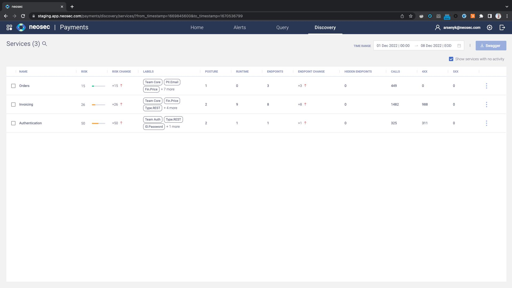
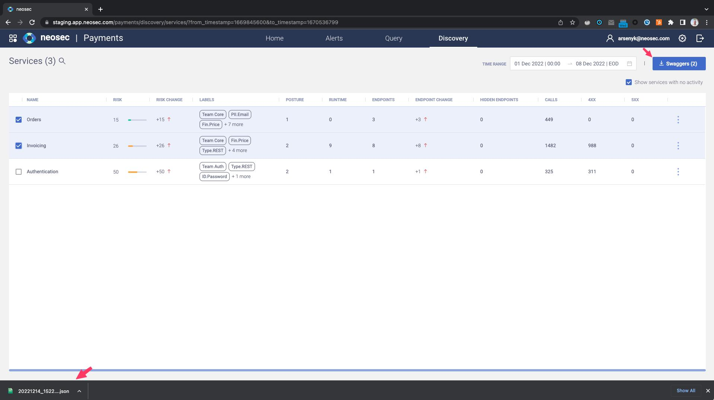
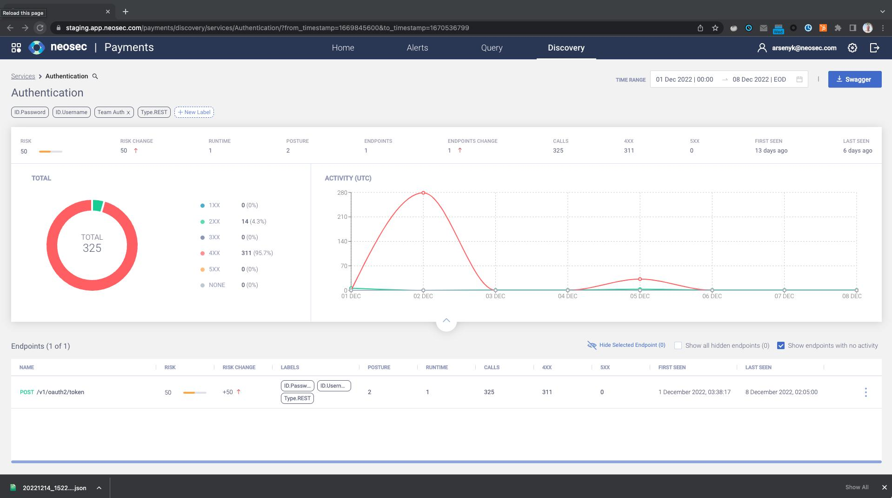
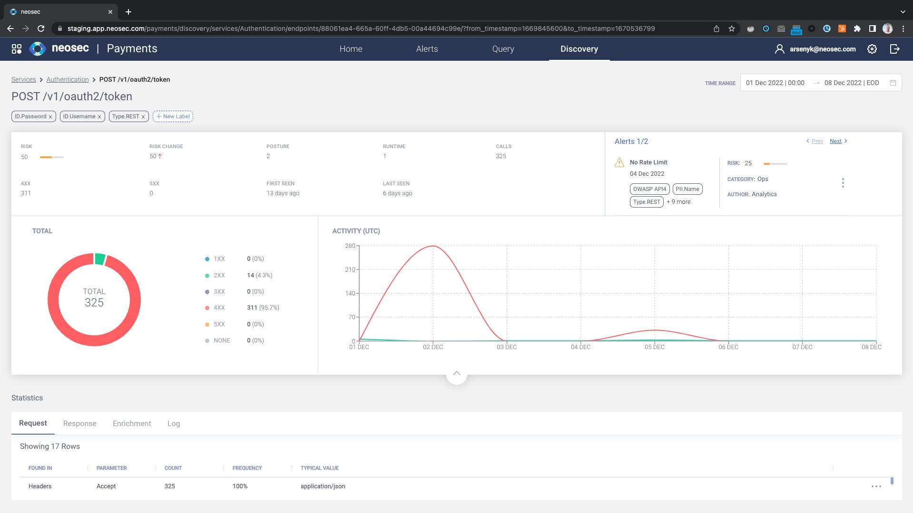
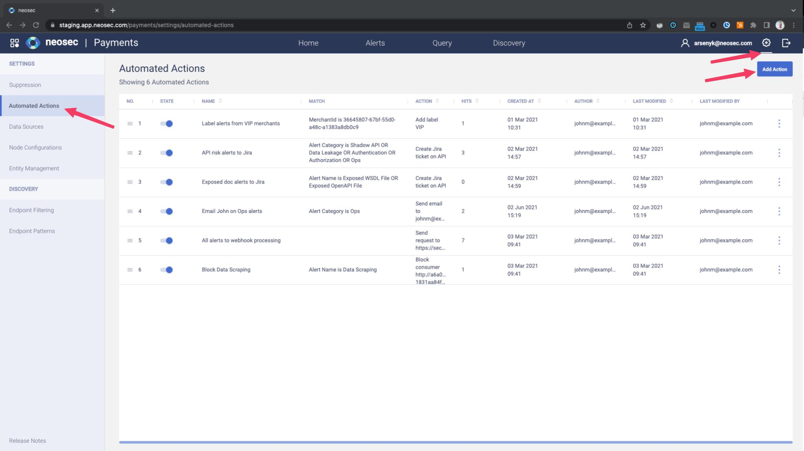
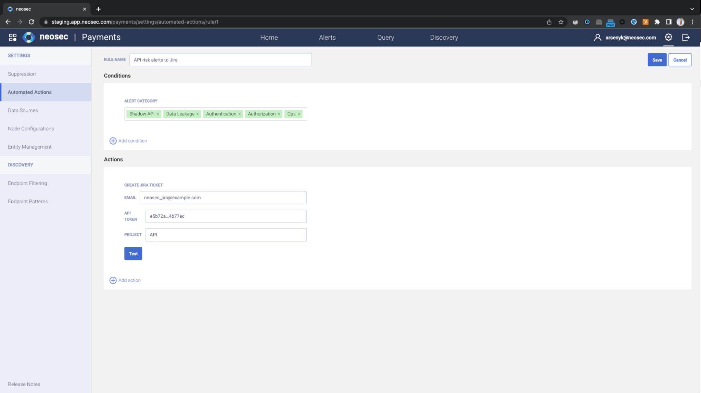
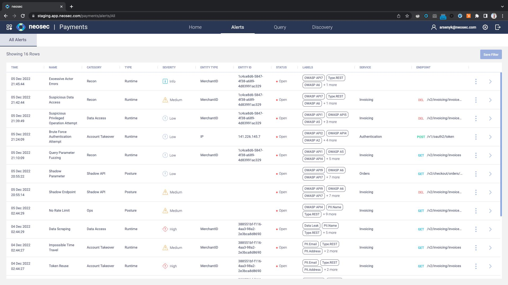
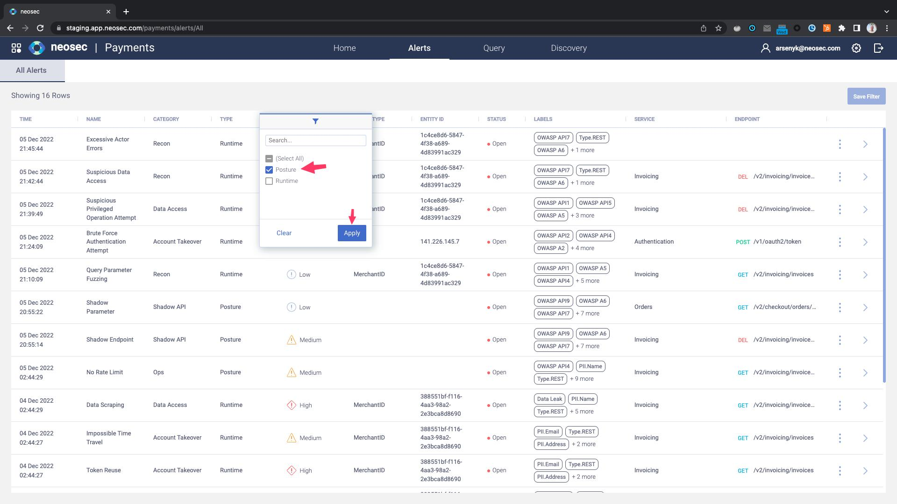
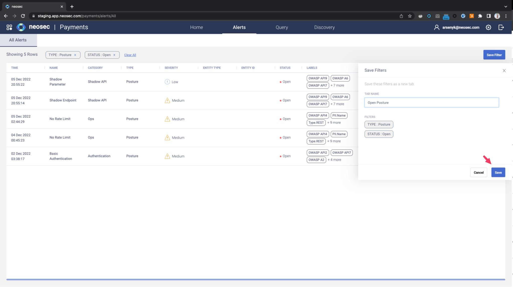
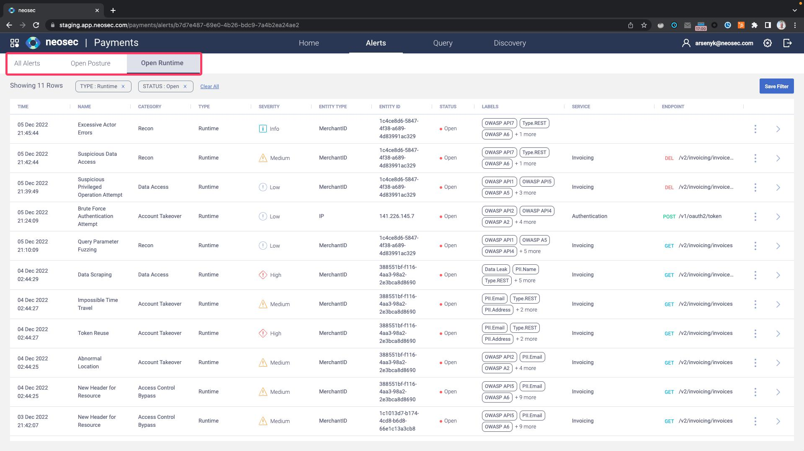

# Module 2

### Exercise 2.1 - Logging and and Home Page

1. Login to [Akamai API Security](https://app.neosec.com) - you should see the home page (the ‘Home’ tab selected)

2. On the Home page you will see a dashboard view of your API landscape. It shows:
    - Alert Overview: Breakdown per label per severity
        - Labels are a powerful and versatile concept in Akamai API Security, used to convey data classification, alert tagging, business impact, and anything the user chooses to
        - Labels are both automatically assigned by the Akamai API Security for various entities (e.g. endpoints, alerts), and assigned by the user using automated action rules
    - Top Alerting Users
    - Top Endpoints - which endpoints get the most requests
    - Recent Alerts
        - You can see that there are some behavioral alerts (anomaly detection), as well as some related to risk posture

### Exercise 2.2 Discover Page

1. Click **Discovery** in the topbar

2. Define the timestamp from August 1st to August 8th

- Ingesting API activity data (e.g. mirrored traffic), the Akamai API Security platform atuomatically discovers all APIs, endpoints, and parameters, classifies the data that passes on them, and triggers alerts on risk posture and not folowing best practices
- The Discovery page shows the APIs as they are used in the real world, based on the system understanding described above:
    - Endpoints are grouped into APIs (AKA services)
    - The data on the page is always true for the time range selected
    - For every service, Akamai API Security sees:
        - The service name
        - The service risk score at the end of the time range, and how it changed over the time range
        - Data classification labels and API type classification labels
        - Service level labels. Note that two service belong to *Team Core* and one to *Team Auth*
        - Open posture alerts at the end of the time range
        - Open runtime alerts referencing this service's endpoints at the end of the time range
        - The number of endpoints in the service at the end of the time range, and how it changed over the time range
        - The number of calls, client-side and server-side errors
    - This page can help you answer questions like:
        - Which service is unders the most active development? (we can see the endpoint change)
        - Which service exposes PII? (using the labels)
        - Which service is being attacked the most? (you can see the number of calls and the errors, as well as the risk score)

### Exercise 2.3 Downlaod the Swagger

1. Select the first 2 services by click on their radio buttons
2. Click on **Swagger (2)'** download button

- The Akamai API Security platform allows you to download the API inventory it created and continuously updates as a Swagger (OpenAPI Specification - or OAS) file
- This is often useful for API developers supporting legacy APIs that are poorly documented or not documented at all

### Exercise 2.4 - Drill Down on the Authentication Service

1. Click on the sort in the **Risk** column
2. The **Authentication** service is now first, since it is the riskiest
3. Click on it

- The **Authentication** service is the riskiest, and has 2 open posture alerts even though it only has a single endpoint in it
- Let's Investigate
- Looking at the service:
    - We see the number of open posture alerts on its enpoints, as well as the overall service risk score
    - We also see traffic statistics, and whether the service is under active development, with endpoints being added during the time range
- You can collapse the top bar to work with the list of endpoints
- And drill down into specific endpoints

### Exercise 2.5 - Drill Down on the Token Endpoint

1. Click on the **token** endpoint

- You get a plethora of information about each and every endpoint in your system
- Including its open posture alerts at the end of the time range, which contribute to its risk score
    - Naturally the place to view and manage alerts is in the **Alerts** page - syou you'll see them there too
    - For this specific endpoint, we see 2 **Posture** alerts, one of them being a **No Rate Limit** alert, as the Akamai API Security analytics engine learned that this specific endpoint seems to not have any rate limit or spike arrest threshold set
- You can collapse the top bar and look at the endpoint's calls (request-response pairs) statistically, including the most common values

#### Exercise 2.6 - The Automated Actions Page

1. Press the **Cog** icon in the top right corner
2. Click **Automated Actions** in the left sidebar
3. Click on the three-dot icon at the end of line 2 (**API risk alerts to Jira**) and choose **Edit Action**

Automated Actions Page

Creation/Modification of Automated Actions

- You can set up automated actions in the Akamai API Security platform will perform when alerts matching your very specific conditions are triggered
- In this case we are looking at opening a Jira ticket in the company's *API* Jira project
- The automated actions currently supported are:
    - Add a label - you can add labels to alerts, that downstream systems could use
    - Change severity - you can decide that under certain circumstances, an alert is critical (for example, if it involves high-profile API users)
    - Send email - you may decide that some alerts are so important they should be sent by mail, either to a person or to a system (e.g. ServiceNow)
    - Trigger webhook - this can be used to integrate with anything
    - Open Jira ticket - shown here
- Akamai is actively working on adding many more response integrations

#### Exercise 2.7 - Alert Types

1. Click on the **Alerts** tab

- The Akamai API Security platform differentiates between 2 types of alerts
    - Posture: Those related to the API's risk posture (the endpoint is vulnerable and something bad might happen)
    - Runtime: Those that trigger on actual API consumer behavior (someone is doing something bad to your API)
- In the **All Alerts** sub-tab you can see by scrolling down **No Rate Limit** and **Weak Authentication** alerts, which are API risk posture alerts
    - These are usually handled by API developers and security architects, who set up automated action rules to open Jira tickets when these things arise
- You can also see runtime alerts such as **Data Scraping** and **Abnormal Location**, which are typically handled by the SOC team (who also love to automate their response)

#### Exercise 2.8 - Create Alert Filters

1. Click on the **Alerts** tab
2. Click on the filter of the **Type** tab
3. Select **Posture** only and click **Apply**
4. Click on the filter of the **Status** tab
5. Select **Open** only and click **Apply**
6. Click **Save Filters** as a tab
7. Name the filter *Posture* and click **Save**
8. Repeat steps 2-7 for open runtime alerts and name the tab *Runtime*

Filter Alerts

Saving Filters

Alert Tabs

- The **Alerts** page allows filtering the alters by type, entity type, service, etc. 
- You can save the filters for future reference
- You can also share the filters with other users on the same tenant by sharing the link

