# Module 2

### Exercise 2.1 - Logging and and Home Page

1. Login to [Akamai API Security](https://app.neosec.com) - you should see the home page (the ‘Home’ tab selected)

2. On the Home page you will see a dashboard view of your API landscape. It shows:
    - Alert Overview: Breakdown per label per severity
        - Labels are a powerful and versatile concept in Akamai API Security, used to convey data classification, alert tagging, business impact, and anything the user chooses to
        - Labels are both automatically assigned by the Akamai API Security for various entities (e.g. endpoints, alerts), and assigned by the user using automated action rules
    - Top Alerting Users
    - Top Endpoints - which endpoints get the most requests
    - Recent Alerts
        - You can see that there are some behavioral alerts (anomaly detection), as well as some related to risk posture

### Exercise 2.2 Discover Page

1. Click **Discovery** in the topbar

2. Define the timestamp from August 1st to August 8th

- Ingesting API activity data (e.g. mirrored traffic), the Akamai API Security platform atuomatically discovers all APIs, endpoints, and parameters, classifies the data that passes on them, and triggers alerts on risk posture and not folowing best practices
- The Discovery page shows the APIs as they are used in the real world, based on the system understanding described above:
    - Endpoints are grouped into APIs (AKA services)
    - The data on the page is always true for the time range selected
    - For every service, Akamai API Security sees:
        - The service name
        - The service risk score at the end of the time range, and how it changed over the time range
        - Data classification labels and API type classification labels
        - Service level labels. Note that two service belong to *Team Core* and one to *Team Auth*
        - Open posture alerts at the end of the time range
        - Open runtime alerts referencing this service's endpoints at the end of the time range
        - The number of endpoints in the service at the end of the time range, and how it changed over the time range
        - The number of calls, client-side and server-side errors
    - This page can help you answer questions like:
        - Which service is unders the most active development? (we can see the endpoint change)
        - Which service exposes PII? (using the labels)
        - Which service is being attacked the most? (you can see the number of calls and the errors, as well as the risk score)

### Exercise 2.3 Downlaod the Swagger

1. Select the first 2 services by click on their radio buttons
2. Click on **Swagger (2)'** download button

- The Akamai API Security platform allows you to download the API inventory it created and continuously updates as a Swagger (OpenAPI Specification - or OAS) file
- This is often useful for API developers supporting legacy APIs that are poorly documented or not documented at all

### Exercise 2.4 - Drill Down on the Authentication Service

1. Click on the sort in the **Risk** column
2. The **Authentication** service is now first, since it is the riskiest
3. Click on it

- The **Authentication** service is the riskiest, and has 2 open posture alerts even though it only has a single endpoint in it
- Let's Investigate
- Looking at the service:
    - We see the number of open posture alerts on its enpoints, as well as the overall service risk score
    - We also see traffic statistics, and whether the service is under active development, with endpoints being added during the time range
- You can collapse the top bar to work with the list of endpoints
- And drill down into specific endpoints

### Exercise 2.5 - Drill Down on the Token Endpoint

1. Click on the **token** endpoint

- You get a plethora of information about each and every endpoint in your system
- Including its open posture alerts at the end of the time range, which contribute to its risk score
    - Naturally the place to view and manage alerts is in the **Alerts** page - syou you'll see them there too
    - For this specific endpoint, we see 2 **Posture** alerts, one of them being a **No Rate Limit** alert, as the Akamai API Security analytics engine learned that this specific endpoint seems to not have any rate limit or spike arrest threshold set
- You can collapse the top bar and look at the endpoint's calls (request-response pairs) statistically, including the most common values

#### Exercise 2.6 - The Automated Actions Page

1. Press the **Cog** icon in the top right corner
2. Click **Automated Actions** in the left sidebar
3. Click on the three-dot icon at the end of line 2 (**API risk alerts to Jira**) and choose **Edit Action**

Automated Actions Page

Creation/Modification of Automated Actions

- You can set up automated actions in the Akamai API Security platform will perform when alerts matching your very specific conditions are triggered
- In this case we are looking at opening a Jira ticket in the company's *API* Jira project
- The automated actions currently supported are:
    - Add a label - you can add labels to alerts, that downstream systems could use
    - Change severity - you can decide that under certain circumstances, an alert is critical (for example, if it involves high-profile API users)
    - Send email - you may decide that some alerts are so important they should be sent by mail, either to a person or to a system (e.g. ServiceNow)
    - Trigger webhook - this can be used to integrate with anything
    - Open Jira ticket - shown here
- Akamai is actively working on adding many more response integrations

#### Exercise 2.7 - Alert Types

1. Click on the **Alerts** tab

- The Akamai API Security platform differentiates between 2 types of alerts
    - Posture: Those related to the API's risk posture (the endpoint is vulnerable and something bad might happen)
    - Runtime: Those that trigger on actual API consumer behavior (someone is doing something bad to your API)
- In the **All Alerts** sub-tab you can see by scrolling down **No Rate Limit** and **Weak Authentication** alerts, which are API risk posture alerts
    - These are usually handled by API developers and security architects, who set up automated action rules to open Jira tickets when these things arise
- You can also see runtime alerts such as **Data Scraping** and **Abnormal Location**, which are typically handled by the SOC team (who also love to automate their response)

#### Exercise 2.8 - Create Alert Filters

1. Click on the **Alerts** tab
2. Click on the filter of the **Type** tab
3. Select **Posture** only and click **Apply**
4. Click on the filter of the **Status** tab
5. Select **Open** only and click **Apply**
6. Click **Save Filters** as a tab
7. Name the filter *Posture* and click **Save**
8. Repeat steps 2-7 for open runtime alerts and name the tab *Runtime*

Filter Alerts

Saving Filters

Alert Tabs

- The **Alerts** page allows filtering the alters by type, entity type, service, etc. 
- You can save the filters for future reference
- You can also share the filters with other users on the same tenant by sharing the link

#### Exercise 2.9 - Comments on Alerts

1. Expand the **Token Reuse** alert
2. See the two comments
3. Click on **Add Comment** and add a comment

Add Comment
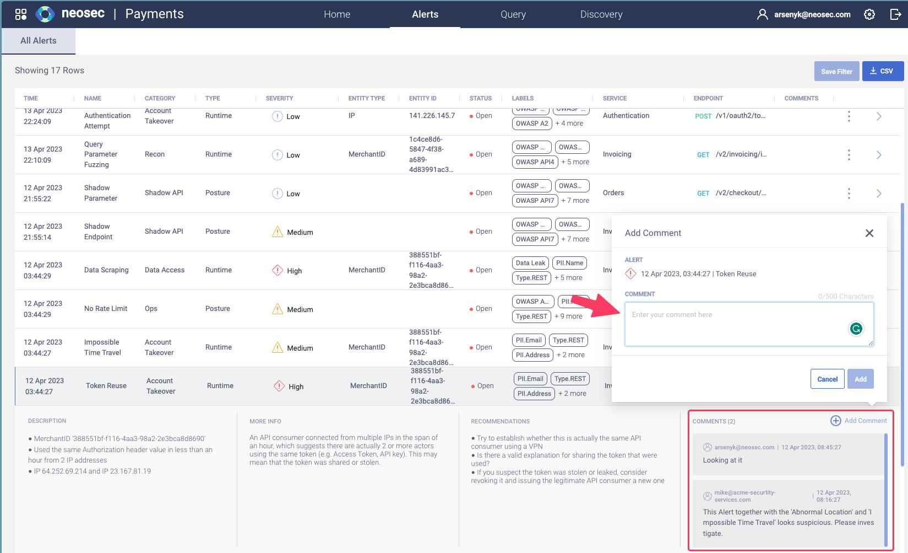

- For easier case management, a user can leave a comment on an Alert
- When closing an alert or changing the severity, the user will be suggested to leave a comment

#### Exercise 2.10 - Posture Alerts

1. Click on the **Alerts** tab
2. Filter on *Open Posture* alerts
3. Click on the three-dot icon at the end of the *Shadow Endpoint* alret row for DEL...
4. Click on the **Go to Endpoint** link

Posture Alerts
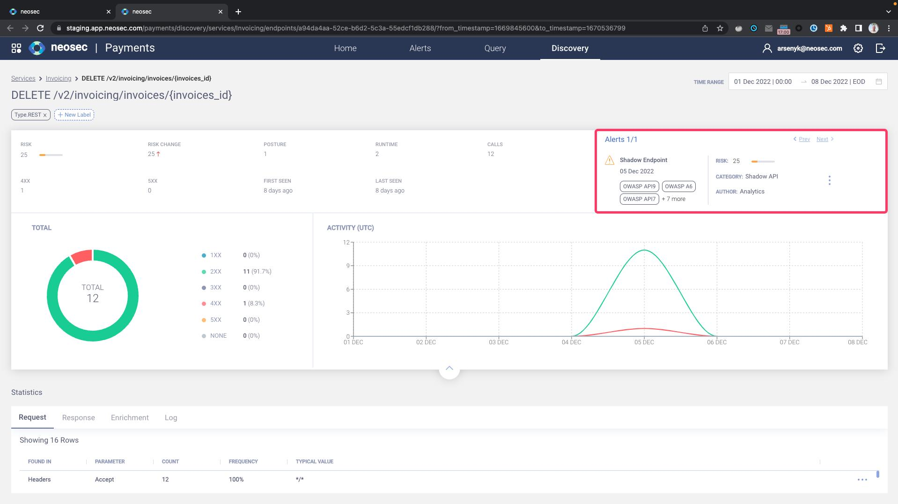

- Posture alerts relate to the APIs risk posture. They relate to the endpoint itself and not to a specific actor (user/ip/etc)
- In this example, the Akamai API Security platform detected an endpoint that wasn't previously known or documented (wasnt' loaded in the pre-configuration) but an activity was spotted against it. For example, it can be an internal endpoint that was built for the UI and someone did some spoofing or wild guess and tried to use it
- In this case, this endpoint will be added to the discovery tab with a *Shadow Endpoint* alert

#### Exercise 2.11 - Runtime Alerts

1. Click on the **Alerts** tab
2. Click on the three-dot icon at the end of the *Token Reuse* alert row for MerchantID 388...

Runtime Alerts
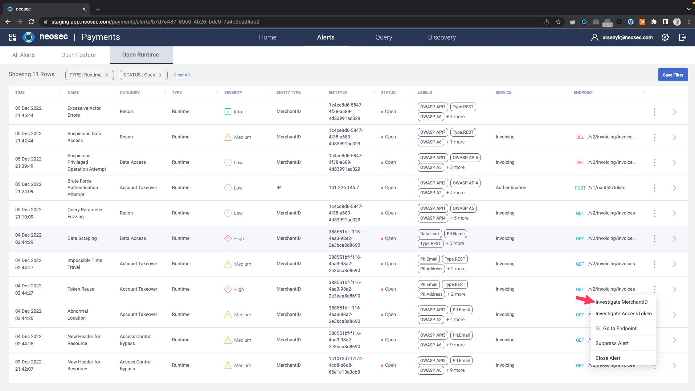

- Since the Akamai API Security platform enriches all incoming logs with entity information - both actor entities (API Consumers) and business entities (API resources) - detection models trigger alerts involving one or more such entities
- This means you can choose how to investigate the alert
- We will pivot to investigating the *MerchantID*, which is the top-most API consumer entity (a merchant's activity spans many access tokens and can be from multiple IP addresses)

#### Exercise 2.12 - Entity Timeline Page

1. Expand the top bar to reveal the merchant's activity over time
2. Scroll the timeline in the left bar to show all activity by the merchant

Entity Timeline
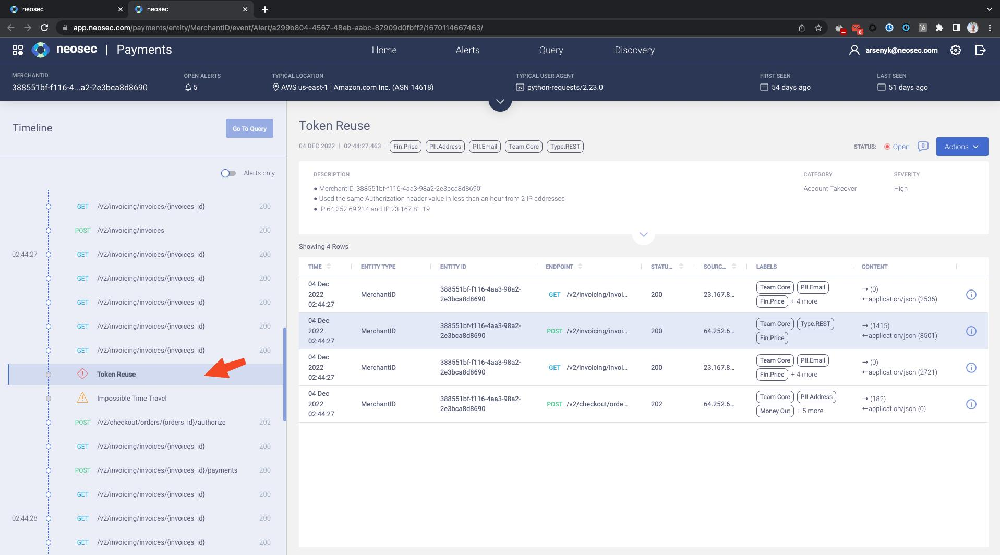

- Alerts are investigated in the context of an entity
    - In this case, we pivoted to see the *Token Reuse* alert in the context of the *MerchantID* 388
- The tob bar gives us information about the entity - its ID, the number of open alerts that triggered on it, its typical location, when the platform first and last saw activity from it, and the activity plotted on graphs
- We see the entity's activity timeline, centered on the alert we pivoted to
    - The timeline shows all of the user's behavior, before and after the alert, providing context for the investigation
- The *Token Reuse* alert is an analytics alert that detects account takeover - where the same access token is being used from several IP addresses at the same time
- Looking at the timeline, we can see that an *Impossible Time Travel* alert also triggered, indicating that the same user is connected from two different countries
- Scrolling further up (back in time) you see that *Abnormal Location* and *New Header ofr Resource* alerts have also triggered on this merchant
    - It is also evident that the merchant was mainly processing order transactions prior to these two alerts on *GET /v2/invoices*

#### Exercise 2.13 - Data Scraping

1. Toggle *Alerts only* above the timeline - you now see there's a *Data Scraping* alert as well on this merchant - click it and un-toggle *Alerts only*

Data Scraping
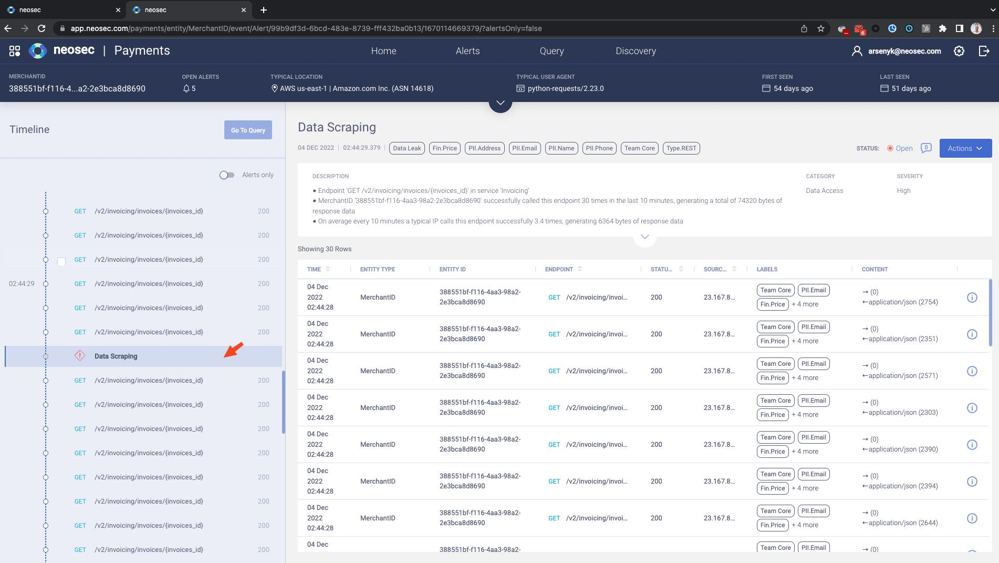

- The user harvested data, in this case by accessing an endpoint many times (compared to other API consumers), retieving large amounts of data
- This is what typically happens after an account takeover, with the next steps being more *active* in nature, if the attacker managed to get the right level of authorization
- We can see that these calls are made from Postman, rather than the regular user-agent used by the merchant (the Python requests library)
- We can also see that these calls were made from a different IP and location (23.xxx - Puerto Rico)
- At this point it is clear that there is some pattern of abuse where an attacker downloads all invoices by listing them first, then systematically accessing the invoices

#### Exercise 2.14 - Data Scraping Remediation

1. Click on the **GET** request around the data scraping alert. Show the extended *Kong Headers*

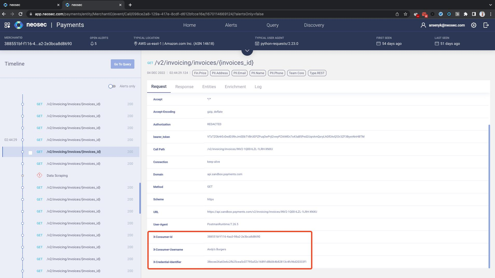

2. Go to **Automated Actions** and show the *Block Data Scraping* action

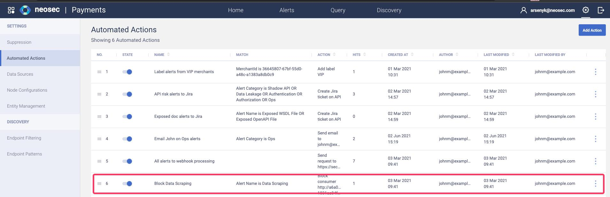

3. Go back to 383 timeline and *Data Scraping* alert
4. Scroll to 03:44:31 and click on the first *GET* request
5. Click on *Response*

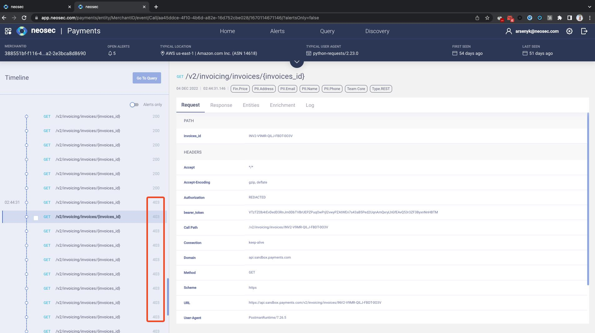

- The Akamai API Security platform has automatic remediation capabilities. We'll demonstrate remediation using the Kong API Gateway integration
- We are displaying the additional headers added by Kong that enriches the request with the *user_id* and a hash of the API token
- We can define an *Automated Action* rule that will automatically block IPs that will be marked with the *Data Scraping* alert
- As you can see, after a delay of a few seconds, all of the data scraping requests from the IP 23.xxx are blocked (403)

#### Exercise 2.15 - API Calls and Entities

1. Scroll back up in the timeline and click on the *GET /v2/invoicing/invoices/{invoices_id}* entry just after the *Abnormal Location* alert
2. Click the **Enrichment** tab and then the **Entities** tab

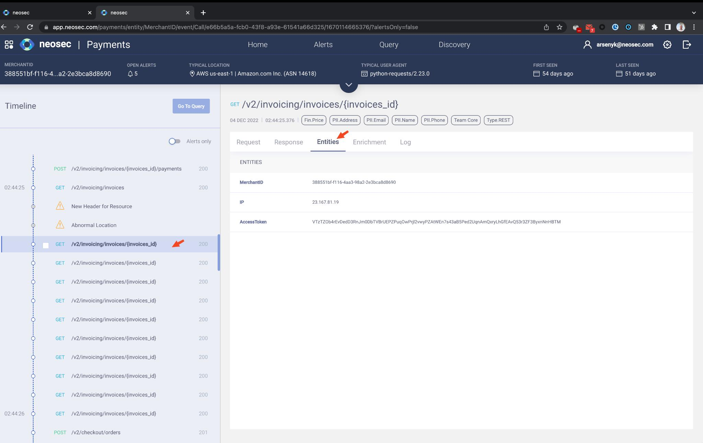

- Fore each call (request/response pair) you can see all details/parameters - ware are now looking at the first invoice that was accessed
- Since all data is enriched - you can click on the entit ID value for any log and be redirected to that entity's timeline page

#### Exercise 2.16 - Business Entity

1. Click the invoice ID link for the invoice ending with *BRIU* - its entity timeline will open in a new browser tab

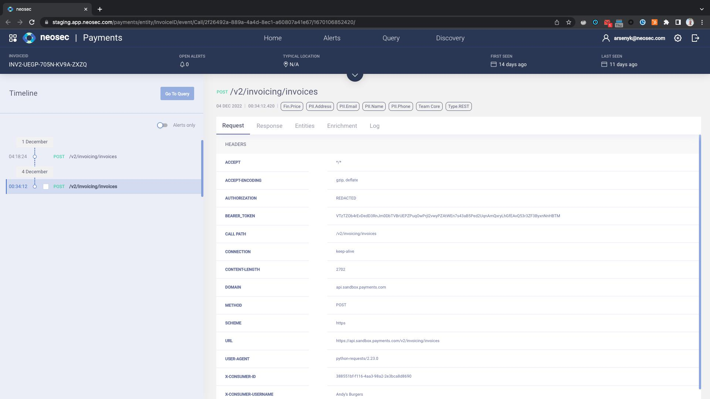

- Having pivoted to the invoice timeline, we can see all activity performed on the invoice
- This is possible for any entity

#### Exercise 2.17 - Query for Sequence

1. Got back to the MerchantID 388 browser tab
2. Check the checkboxes of *GET List invoice* and 2 following *GET Show invoice* calls
3. Press the **Go To Query** button, which will open the Query page in a new browser tab

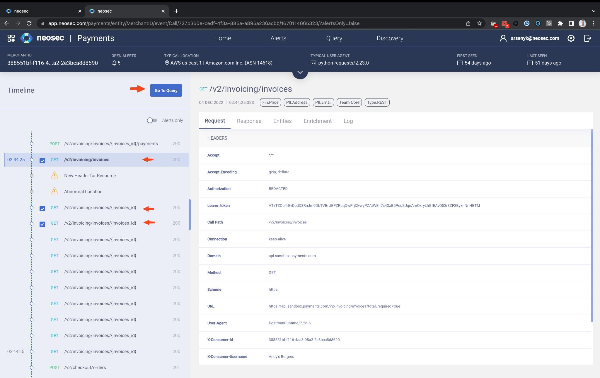

##### Query Page

1. Note that since we pivoted from a timeline with selected calls, all values are already filled in
2. Press **Search** in the top right corner

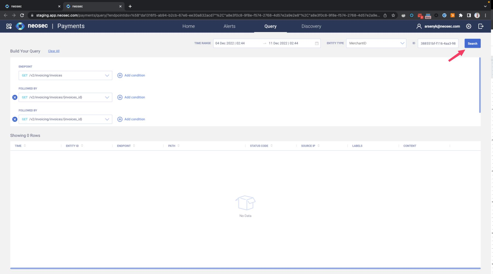

- The Query page provides an open-ended view into any observed user behavior. It also enables querying for sequences of actions, either by defining them or by referring to sequences that were previously defined
- Since we pivoted from 3 *Show invoice* calls, the Query page has them listed one after the other, with the time range and entity type (MerchantID) and ID(388...) already filled in
- This means we will see the calls for our 388... merchant, of course

#### Exercise 2.18 - Query

1. Clear the *ID* field and the *Time Range* field
2. Press the **Search** buton again

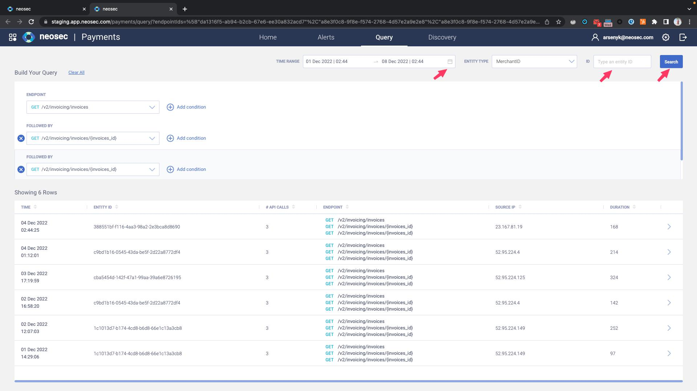

- We see that this behavior - getting a list of invoices and then showing 2 invoices - is something that happens in several merchants, not just our compromised 388... merchant
- We can now pivot to any of these and investigate them in the contexct of the relvant merchant
    - This is since all calls are enriched with entities, and in spite of not having any laerts for these other merchants

#### Exercise 2.19 - Pivot to User Timeline

1. Expand the third row, with MerchantID cba...
2. Click the three-dot icon on the first call (GET /v2/invoicing/invoices) and click **Investigate MerchantID**

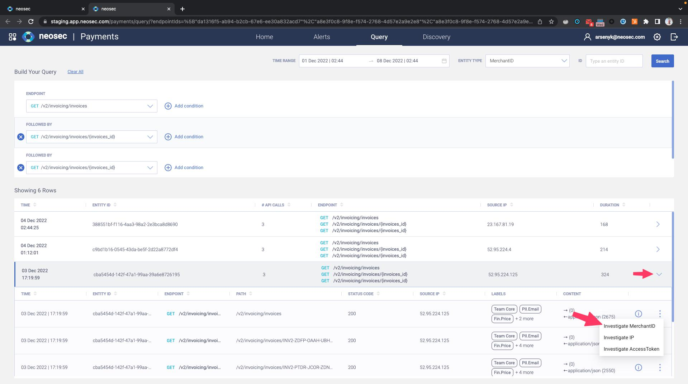

- We are now investigating a similar sequence of calls, in this context of antoher merchant, who does not have any open alerts and typically connects from AWS eu-south-1
- We can do this sort of pivoting to any entity, since all API activity data is stored enriched in the *data lake*

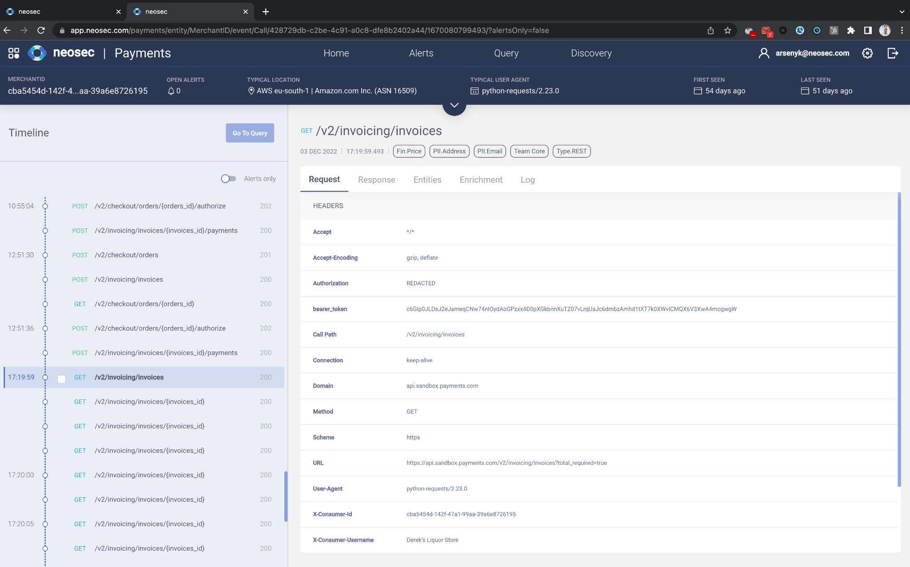

#### Exercise 2.20 - Tokenization

***PREFACE***

All senstive data is tokenized in the Akamai API Security Nodes on premises prior to sending data to the Akamai Cloud. Akamai Cloud, and subsequently, the Akamai API Security UI, contain tokenized values only.

1. See the difference between the tokenized entity on the top *Query Parameter Fuzzing* alert compared to other entities

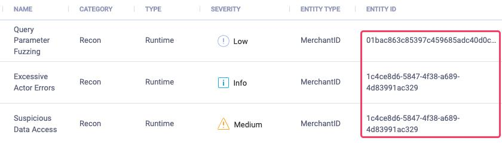

2. Click the three-dot menu on the top *Query Parameter Fuzzing* alert
3. Click *Investigate Merchant Id* to see the entity timeline
4. Click (I) on a single request and show that the *Authorization* and the ‘query’ values are tokenized

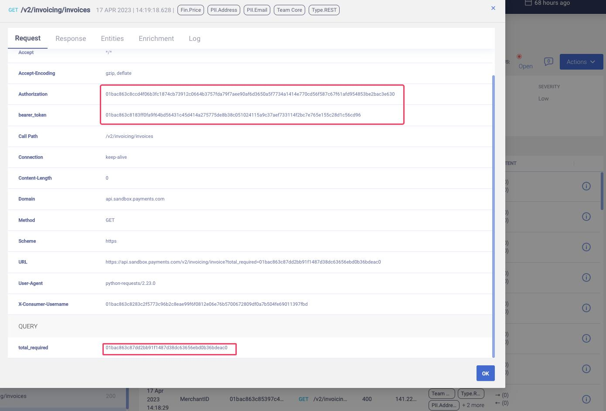

- After finishing the POV, tokenization was activated on the *Payments* tenant
- Since activation, all sensitive data in *Discovery* and *Alerts* is tokenized
- Detokenization is only possible on the customer premises against the Akamai API Security Node

#### Exercise 2.21 - Pen Tester Story

1. Click on the **Alerts** tab
2. Filter on *Open Runtime* alerts
3. Click on the three-dot icon at the end of the *Query Parameter Fuzzing* alert row for merchant 1c4c
4. Click on the *investigate IP* option

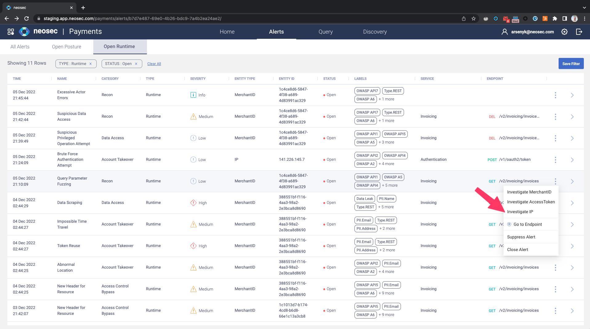

- In this example, a pen-tester created two merchant IDs - 1c4c… and 9342… from the same IP, and then started penetration testing the APIs
- The pen tester probed the API by sending bad inputs to query parameters, triggering a *Query Parameter Fuzzing* alert
- The pen tester then attempted to break the authentication by trying various passwords for one of his account - a *Brute Force Authentication Attempt* alert triggered
- The pen tester attempted to access an endpoint which few users have access to and is therefore assumed to be a privileged endpoint (BFLA)
- Following that, the pen tester created two orders using two different users and successfully managed to access the order created by one user from the other user. This is an exploitation of a BOLA vulnerability, which triggered the *Suspicious Data Access* alert
- Finally, as all these actions generated a lot of errors, an *Excessive Actor Errors* alert triggered on the IP address the pen tester used

#### Exercise 2.22 - Posture Alerts

1. Click on the **Alerts** tab and then on the **Posture** sub-tab

- Posture Alerts are about your API's risk posture
- Two of the posture alerts are of the Shadow API family:
    - Shadow Endpoint - accessing an undocumented endpoint
    - Shadow Parameter - using an undocumented enpoint parameter
- Note that two alerts above are posture alerts, so they don't appear on entity timelines (other than as calls) but rather on the endpoints themselves